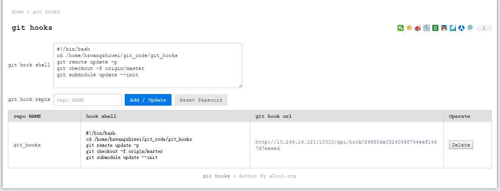
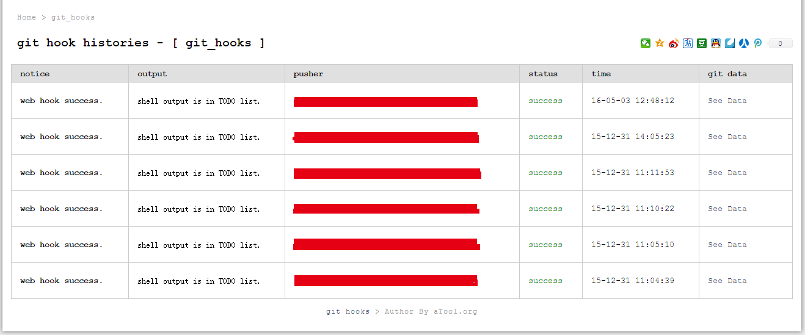
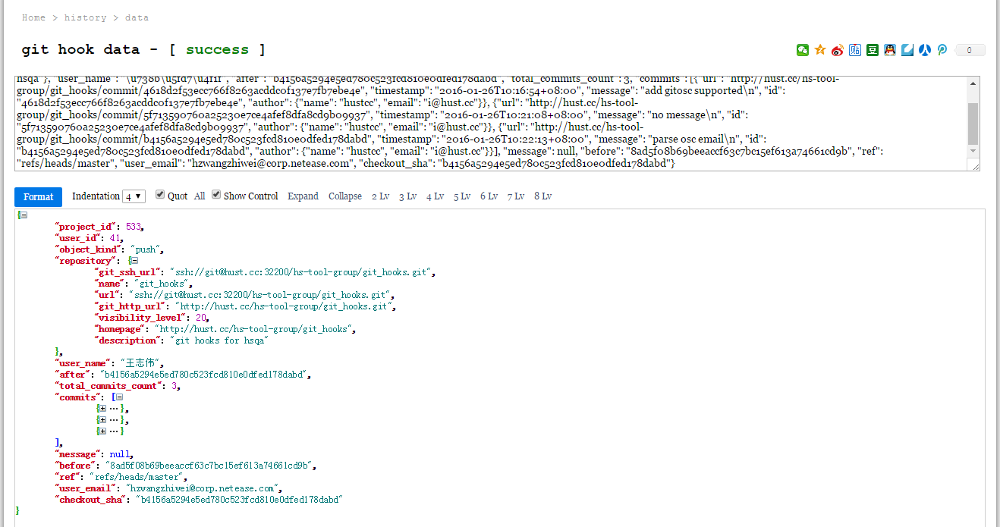

# Git Webhooks

> 一个使用 Python Flask + SQLite 开发的用于迅速搭建并使用  WebHook 进行自动化部署和运维，支持：**Github / GitLab / GitOsc**。

  

## 一、如何使用 ？

1. 下载本项目代码：

	```sh
	git clone git@github.com:hustcc/git_hooks.git
	```

2. 安装 Python 依赖

	```sh
	pip install requirements.txt
	```

	这里暂时还没有整理 requirements.txt 文件，所以，直接运行缺什么就安装什么吧。

3. 运行应用

	```sh
	python run_githooks.py
	```
	
	运行之后，打开 http://127.0.0.1:10010 即可访问，初次使用，请设置好密码，不过这并不是非常非常安全，所以请注意安全防护。

4. 添加WebHook

	在工具中添加 Git 项目，获得 WebHook URL，并填写到 Github / GitLab / OscGit 的 WebHook 配置中。


## 二、效果预览

项目列表



项目提交历史情况



提交具体数据




## 三、注意

1. 工具直接使用 Flask 搭建了一个 Web 界面，方便操作，查看历史提交情况；
2. 但是这样并不是非常安全，大家都可以看到目前在自动处理的命令和项目；
3. 虽然有密码设置，但是因为没有验证码，所以也可能会被暴力破解；
4. 本项目目前是在内网使用，运行良好，如果是外网环境，并且服务器安全限制要求比较严格，不建议使用；


## LICENSE

MIT @hustcc
