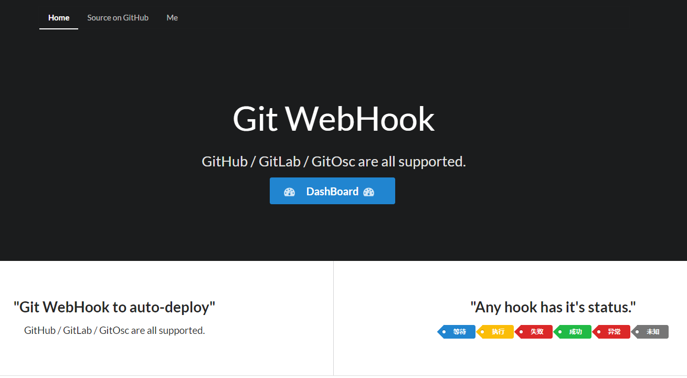
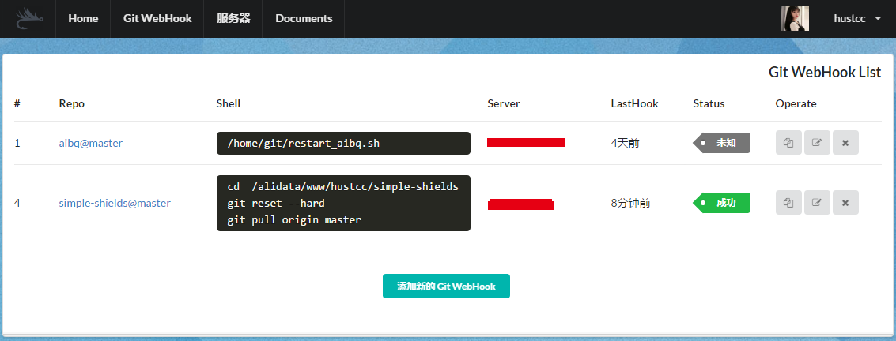
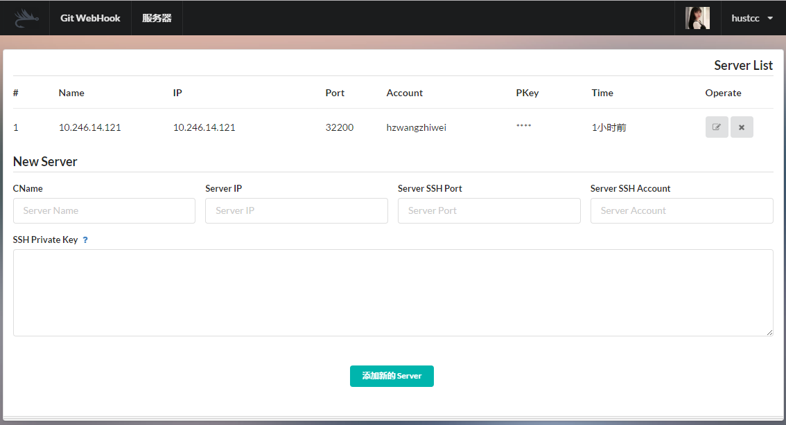
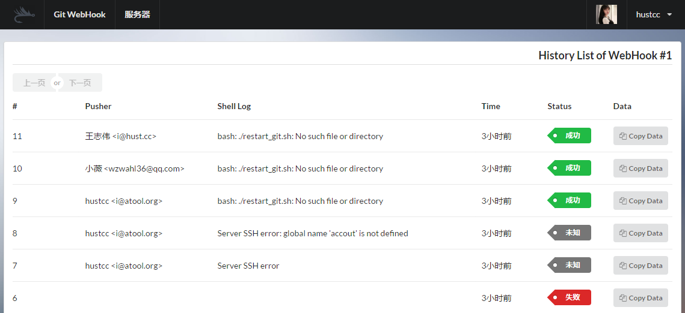

# Git WebHook

> 一个使用 Python Flask + SQLAchemy + Celery + Redis + React 开发的用于迅速搭建并使用  WebHook 进行自动化部署和运维系统，支持：**Github / GitLab / Gogs / GitOsc**。

**若觉得 git-webhook 部署依然比较复杂，可以尝试更为简洁的 cli 版本：[webhookit](https://github.com/hustcc/webhookit)。**在线实例可以查看[这里](http://webhookit.hust.cc)。

[](https://pypi.python.org/pypi/git-webhook) [](https://travis-ci.org/NetEaseGame/git-webhook) [](https://codecov.io/gh/NetEaseGame/git-webhook)    

 - 技术栈简单，**部署**容易；
 - 代码简洁易懂，**二次开发**毫无压力；
 - 支持 **Github / GitLab / Gogs / GitOsc**；
 - 使用 SSH 方式，支持**多服务**配置；

[Project ChangeLog](CHANGELOG.md) | [Online DEMO Website](http://webhook.hust.cc/)（使用 nginx 部署绑定域名）


## 一、如何使用 & 部署 ？

习惯使用 Docker 的老司机直接看[如何使用 Docker 部署 Git-WebHook](deploy-docker.md)。

1. 安装 git-webhook：

	```sh
	pip install git-webhook
	```

	备注：项目中某一个依赖库需要安装 **python-dev**。

2. 创建配置

	```sh
	gitwebhook config
	```
	命令执行之后，会在对应用户目录生成新的配置文件，然后对应修改配置文件内容。主要需要配置三点：
	
	 - `DATABASE_URI`: 数据库地址，理论上可以使用**任何关系数据库**；推荐使用 sqlite 和 mysql （经过测试）；
	 - `CELERY REDIS`: Redis URI 配置，主要用于 Celery 后台任务；
	 - `GITHUB`: GitHub 登陆配置，可以到 [OAuth applications](https://github.com/settings/developers) 自行申请，登陆 Callback 地址为： `your_domain/github/callback`.

3. 初始化数据库结构

	```sh
	gitwebhook createdb
	```

4. 运行应用

	```sh
	# 1. run python webserver
	gitwebhook runserver
	# 2. run celery async task
	gitwebhook celery
	```
	
	运行之后，打开 http://127.0.0.1:18340 （一巴扇死你）即可访问。使用 GitHub 账号登陆。

5. 添加WebHook

	在工具中添加 WebHook 项目，获得 WebHook URL，并填写到 Github / GitLab / OscGit 的 WebHook 配置中。


**安装之后如何使用？**直接看你部署的 Web 应用文档吧，或者在[这里](http://webhook.hust.cc/#/doc/webhook)也可以看到。


## 三、效果预览

 - **首页**



 - **WebHook列表**



 - **服务器列表**



 - **WebHook 历史记录**




## 四、部署

代码使用 Flask 框架开发，`gitwebhook runserver` 运行可以用于线上生产环境，可以额外使用 nginx 做负载均衡和域名绑定。

主要的服务器依赖环境：

 - 数据库环境（自行选择，推荐 mysql 和 sqlite）；
 - Redis，利用 Celery 做后台任务；

**备注**：如果使用 gunicorn 部署， worker 数量必须为 1，建议 worker 类型为 eventlet (`gunicorn -k eventlet -w 1`)，并且 nginx 负载均衡的时候，需要使用 ip_hash 算法。
具体请参考: [gunicorn-web-server](http://flask-socketio.readthedocs.io/en/latest/#gunicorn-web-server)

当然也可以直接[使用 Docker 部署](deploy-docker.md)。


## 五、贡献

项目使用 SSH 私钥 / 账户密码的方式，直接登陆 Linux 服务器，执行部署或者运维的 Shell 命令，安全可靠，当然因为涉及到**私钥**，或者**用户密码**，所以为了安全起见，建议在内网搭建使用（这些是我们的使用情景）。

**后端开发**使用：Python Flask + SQLAchemy + Celery + Redis，常规的技术栈；

**前端开发**使用 React + Webpack，并没有使用其他消息通信框架。

所以整体项目代码非常简单，大部分都能够修改和更新代码，并提交 Pull Request，目前系统 TODO 包括，我个人也将注意完善：

 - Celery 进程情况显示（当 Celery 进程没有执行的时候，在页面上提示，类似于 Sentry）；
 - 系统状态和统计（任务队列实时情况，WebHook 执行的统计图表等）；


## LICENSE

MIT @hustcc
